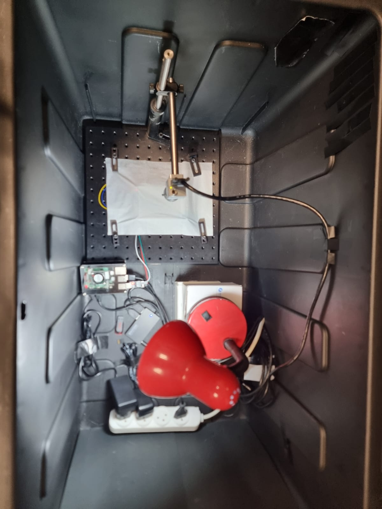
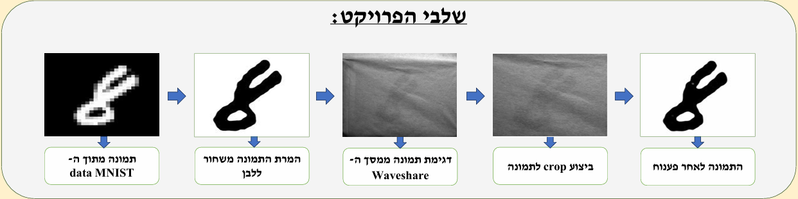

# Imaging Through Diffusive Tissue

## Overview

This project explores a novel approach for medical imaging using Near-Infrared (NIR) light as a safer alternative to X-ray imaging.

One of the main challenges of NIR imaging is that images become highly distorted when passing through a diffusive medium. To address this problem, an Encoder-Decoder neural network was developed to reconstruct the original image from the distorted captured image.

The project combines image processing, deep learning, hardware integration, and experimental validation.

---

## Experimental Setup

The experimental platform consists of a Raspberry Pi controlling a Waveshare display, a diffusive medium placed in front of the display, and a Basler camera used to capture the distorted images.



---

## Results

The following figure presents the complete image reconstruction pipeline, starting from the original MNIST image, through image acquisition and preprocessing stages, and ending with reconstruction using the Encoder-Decoder neural network.



---

## Hardware Components

* Raspberry Pi
* Waveshare Display
* Basler Camera
* UART Communication Interface
* Controlled Illumination System
* Diffusive Medium

---

## Software Components

* Python
* TensorFlow / Keras
* OpenCV
* NumPy
* Matplotlib

---

## System Architecture

MNIST Dataset

↓

Image Preprocessing

↓

Waveshare Display

↓

Diffusive Medium

↓

Basler Camera Capture

↓

Encoder-Decoder Neural Network

↓

Reconstructed Image

---

## Project Structure

```text
data_preparation/
    Dataset generation and preprocessing

simulation/
    Diffusive medium simulation

neural_network/
    Encoder-Decoder implementation and training

hardware_system/
    Raspberry Pi, UART communication and image acquisition

docs/
    Project poster and final report

results/
    Experimental images and results
```

---

## Documentation

Additional project documentation can be found in:

* Project Poster (`docs/poster_project.pdf`)
* Final Project Report (`docs/book_project.pdf`)

---

## Author

Uriya Avdar

B.Sc. Electrical and Electronics Engineering

Final Project

Azrieli College of Engineering Jerusalem
